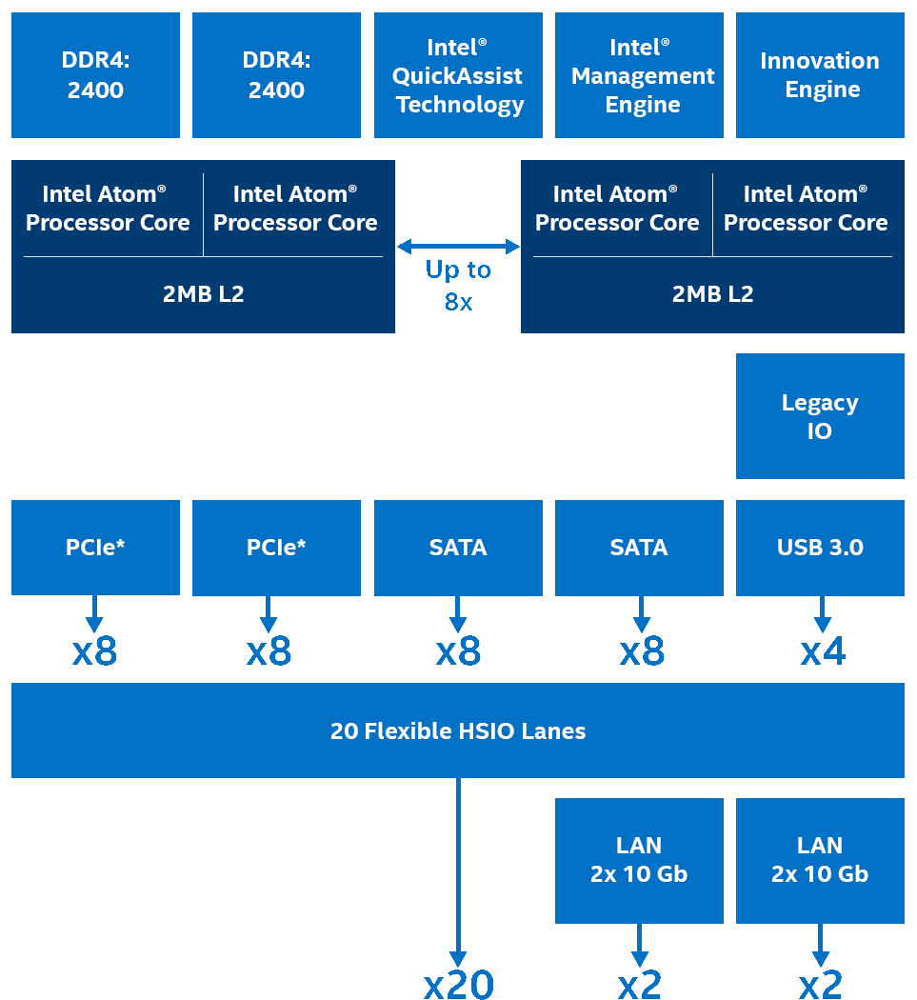
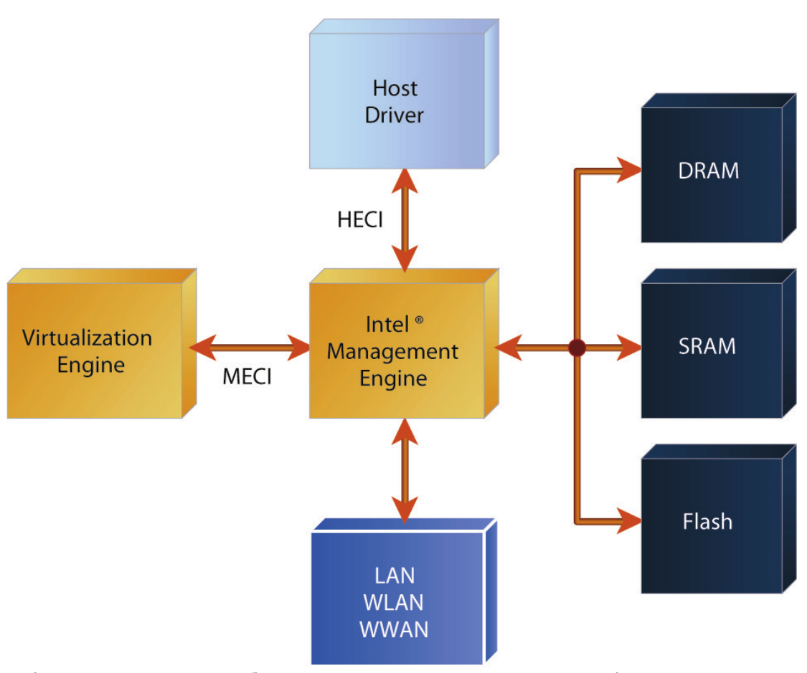
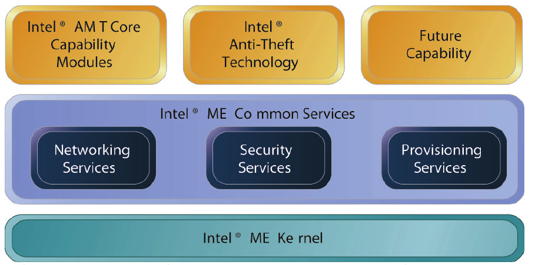
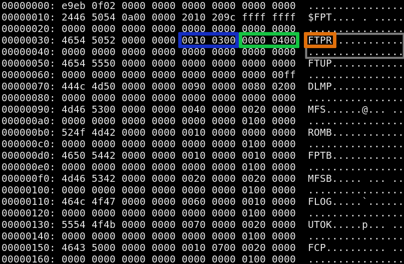
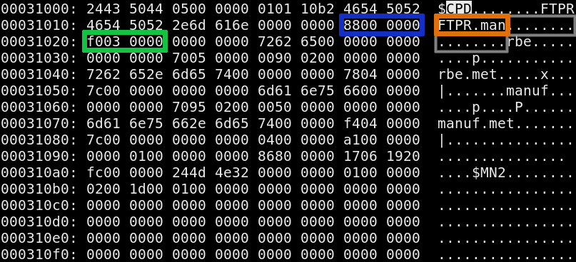

## Agenda

- Introduction
- Motivation
- Data Structures
- Open Source Firmware

# Introduction

## What

- [Intel ME](https://www.intel.com/content/www/us/en/support/articles/000008927/software/chipset-software.html)
- [Positive Research](https://github.com/ptresearch?tab=repositories)

## History

Once upon a time...

see [Igor Skochinksy's talk](https://ftp.halifax.rwth-aachen.de/ccc/congress/2017/slides-pdf/34c3-8782-intel_me_myths_and_reality.pdf)

- 2004: AMT (Active Management Technology) announced
- 2005: AMT/ME 1.0 - ARC CPU inside Tekoa LAN. IDE-R, SoL, SOAP API.
- 2006: AMT/ME 2.0 - ME moves into GMCH (North bridge).
- 2007: 3.0(desktop) / 4.0 (mobile)
    * first variants without AMT. QST, iTPM appears.
    * 4.1 adds TDT (Theft Deterrence Technology)
- 2009: AMT/ME 6.0
    * first PCH platform, ME Gen 2 (ARC600 CPU)
    * KVM support (using VNC protocol)
- 2011: ME 7.1 - DAL (Dynamic Application Loader) for IPT/OTP
- 2014: ME 10.0 - Removal of TDT (Anti-Theft) feature
- 2015: ME 11.0 - First Gen 3 release (x86 core, Minix OS)

## Version 12.0

- [Intel ME 12.0 architecture](https://software.intel.com/sites/manageability/AMT_Implementation_and_Reference_Guide/default.htm?turl=WordDocuments%2Fintelamtrelease120architecture.htm)

- with [Intel ME >=12.0n AMT can be disabled](https://software.intel.com/sites/manageability/AMT_Implementation_and_Reference_Guide/default.htm?turl=WordDocuments%2Fdisablingintelamt.htm)

## x86 block diagram

see [Intel website](https://www.intel.com/content/www/us/en/design/products-and-solutions/processors-and-chipsets/denverton/ns/atom-processor-c3000-series.html)

:::::::::::::: {.columns}
::: {.column width="50%"}

{ width=100% }

:::
::: {.column width="50%"}

- Management Engine
- Innovation Engine

:::
::::::::::::::

## Intel ME

## Intel ME services

# Motivation

## yolo

# Data Structures

## FPT data structure

:::::::::::::: {.columns}
::: {.column width="75%"}

{ width=100% }

:::
::: {.column width="25%"}

- partition `FTPR`
- offset `0x31000`
- size `0x40000`

:::
::::::::::::::

## CPD data structure

see [Win-Raid Forum](https://www.win-raid.com/t596f39-Intel-Management-Engine-Drivers-Firmware-amp-System-Tools-74.html)

:::::::::::::: {.columns}
::: {.column width="75%"}

{ width=100% }

:::
::: {.column width="25%"}

- file `FTPR.man`
- offset `0x88`
- size `0x3f0`

:::
::::::::::::::

# Open Source Firmware
