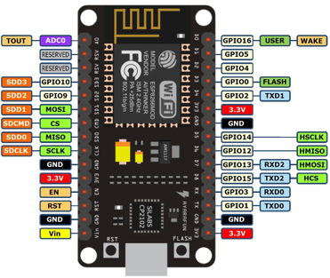
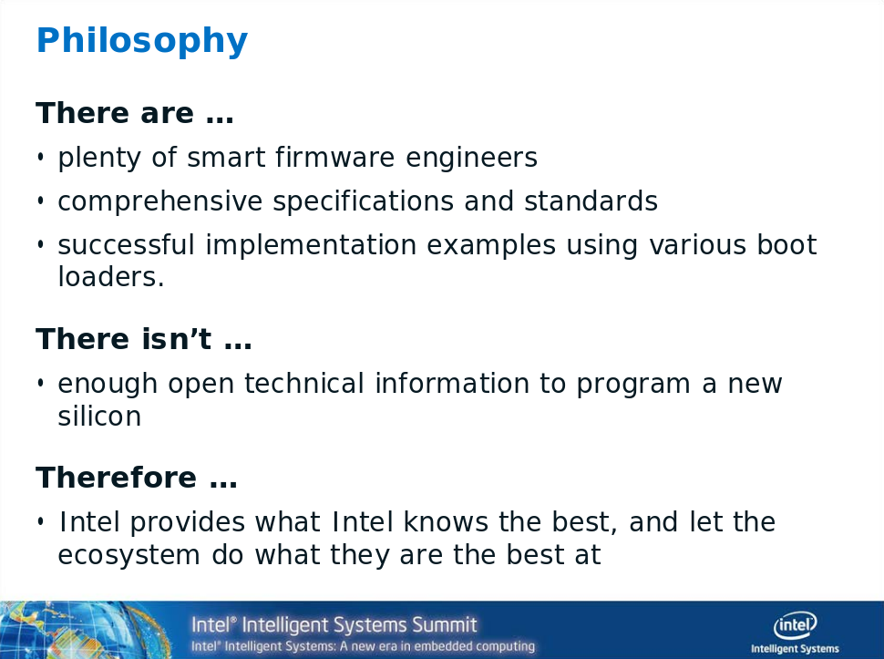

## Disclaimer

### This is not about whether we should trust Intel or any (chip) vendor.

### Many details about the ME are not public or scattered across the web.

### I probably have errors in some places; please report them to me.

## Agenda

- Introduction
- Open Source Firmware
- Intel x86 Hardware
- Motivation
- Firmware Analysis
- Conclusion

# Introduction

## Microcontrollers and fun

:::::::::::::: {.columns}
::: {.column width="2%"}
:::
::: {.column width="32%"}
{ height=30% }
:::
::: {.column width="2%"}
:::
::: {.column width="32%"}
{ height=30% }
:::
::: {.column width="32%"}
{ height=30% }
:::
::::::::::::::

## Microcontrollers and SoCs on your x86 mainboard

:::::::::::::: {.columns height=30%}
::: {.column width="38%"}
- Chipset (southbridge)
- Gigabit Ethernet (Gbe)
- USB controller
- PCI(e)
- SATA
- GPU
- HD Audio
- Bluetooth module
- Wi-Fi module
- ...
:::
::: {.column width="62%"}
{width=100%}

Kaby Lake U Mobile block diagram adapted from [Intel specifications](https://www.intel.com/content/www/us/en/embedded/products/kaby-lake-u/specifications.html)

### Critical Controllers

- Trusted Platform Module (TPM)
- Embedded Controller (EC)
- Baseboard Management Controller (BMC)
:::
::::::::::::::

# Open Source Firmware

## Open Source Firmware projects

### Host (CPU, main SoC, chipset)

- coreboot
- LinuxBoot
    * Heads
    * u-root

### Embedded Controller (EC)

- [Chromium OS EC](https://chromium.googlesource.com/chromiumos/platform/ec/+/master/README.md)
- [System76 EC](https://github.com/system76/ec)

### Baseboard Management Controller (BMC)

- OpenBMC
- u-bmc

# Intel x86 Hardware

## Intel chipsets

{width=100%}

## A closer look: Denverton platform

### see [Intel website](https://www.intel.com/content/www/us/en/design/products-and-solutions/processors-and-chipsets/denverton/ns/atom-processor-c3000-series.html) and [WikiChip](https://en.wikichip.org/wiki/intel/cores/denverton)

{ width=55% }

### So what is this...?

- [Management Engine](https://www.intel.com/content/www/us/en/support/articles/000008927/software/chipset-software.html)
- Innovation Engine

## Intel Management Engine (today)

- microcontroller unit (MCU)
- part of chipset or System on Chip (SoC)
- connected to SPI flash, CPU, GbE
- started from Active Management Technology (AMT)
- may offer runtime services (more later)
- can verify host firmware (more later)

## Innovation Engine

### From Intel's website

> Enables next-generation systems to customize solution *firmware* to drive greater operational efficiency, security, and predictive maintenance.

- HP Enterprise is using it
- just a copy of the ME MCU

## Intel platform boot sequence

### How it all works together

{ width=100% }

## [vPro](https://www.galaxy.com.pl/en/intel-vpro-en/)


## What is this vPro thing?

- umbrella marketing term for a set of technologies
    * includes AMT (Active Management Technology)
- as per ARK, for some chips, there is no "eligibility"
    * the hardware still supports it though
    * Intel does [not provide details on eligibility]()

### People are trying to figure out [technicalities and availability details](https://u-root.slack.com/archives/CCWLQKEHG/p1579946453042500).

> _mzygowski_: I think BtG is supported on all CSME/ME silicons. TXE may be different (SecureBoot). ApolloLake TXE should have BtG (saw some Intel docs about it). So the information is really scattered

## vPro Platform Security Features

### It is hard to sum up how the entire platform works because everything is related.

- SGX (Software Guard Extensions)
- TXT (Trusted Execution Technology)
    * [PTT](https://www.intel.com/content/dam/www/public/us/en/documents/white-papers/enterprise-security-platform-trust-technology-white-paper.pdf),
a TPM 2.0 implementation
- BootGuard

## AMT, MEI and ISH

### Active Management Technology

- available through MEI driver
    * hardware monitoring
    * power control
    * OS updates
    * storage
    * proxy for KVM (keyboard, video, mouse)

### Management Engine Interface

-  implemented in [Linux kernel](https://www.kernel.org/doc/html/latest/driver-api/mei/index.html)

### Integrated Sensor Hub

- dedicated low power co-processor
- implemented in [Linux Kernel](https://www.kernel.org/doc/Documentation/hid/intel-ish-hid.txt)

## MEBX

### Management Engine BIOS Extensions

- configuration interface in host firmware
- [Ctrl + P](https://wiki.fysik.dtu.dk/it/Intel_AMT#management-engine-bios-extension-mebx) or [F6](hp something TODO)
- default password is `admin`

## Once upon a time...


adapted from [Igor Skochinksy - Intel ME Myths and Reality](https://ftp.halifax.rwth-aachen.de/ccc/congress/2017/slides-pdf/34c3-8782-intel_me_myths_and_reality.pdf), Wikipedia and Intel

## Intel ME Version 12.0

- most recent documented release
- [release notes are public](https://software.intel.com/sites/manageability/AMT_Implementation_and_Reference_Guide/default.htm?turl=WordDocuments%2Fintelamtrelease120architecture.htm)
- supports TLS 1.2, dropped 1.0
- `CIM_Battery` class
- [AMT can be disabled](https://software.intel.com/sites/manageability/AMT_Implementation_and_Reference_Guide/default.htm?turl=WordDocuments%2Fdisablingintelamt.htm)
- category of "super_critical" events

### Version 14.0 has already been found in the wild in 2019.

## ME Firmware Variants

+--------+--------------------------+
| CON(S) | Consumer                 |
+--------+--------------------------+
| COR(P) | Corporate                |
+--------+--------------------------+
| SLM(?) | Slim                     |
+--------+--------------------------+
| SPS    | Server Platform Services |
+--------+--------------------------+
| IGN(?) | Ignition                 |
+--------+--------------------------+

# Motivation

## First public release of a [redistributable ME firmware binary](https://edk2.groups.io/g/devel/message/50920)

### EDK II non-osi mailing list

> Ignition Firmware is a variant of ME firmware that is intended to provide
> lightweight chipset initialization. It does not contain all the features
> of the Intel® Server Platform Services (SPS) ME firmware. Ignition Firmware
> is consequently much smaller than Intel® SPS Firmware (~0.5 MB vs. ~3 MB).

### Build and distribute full firmware images with binaries

- Firmware Support Package (FSP) for host firmware
- Ignition ME firmware for Cascade Lake / Purley

## Follow the yellow brick road...

{ height=80% }

## ME Ignition Firmware License

> Redistribution and use in binary form, without modification, are permitted,
> provided that the following conditions are met:
> 
> 1.  Redistributions must reproduce the above copyright notice and the
>     following disclaimer in the documentation and/or other materials provided
>     with the distribution.
> 
> 2.  Neither the name of Intel Corporation nor the names of its suppliers may
>     be used to endorse or promote products derived from this software without
>     specific prior written permission.
> 
> 3.  No reverse engineering, decompilation, or disassembly of this software
>     is permitted.

## Pay no attention to that man behind the curtain!

{ height=80% }

## Philosophy

taken from [training slides for FSP by Intel](https://www.intel.com/content/dam/www/public/us/en/documents/training/intel-firmware-support-package-technical-training.pdf)



## Vendor perspective

taken from the [FSP whitepaper](https://www.intel.com/content/dam/www/public/us/en/documents/white-papers/fsp-iot-royalty-free-firmware-solution-paper.pdf)

> Intel is working towards releasing as much source code as possible going
> forward. A binary component is still the best way to encapsulate the complex
> solution that developers may not necessarily need to bother about as long as
> the binary component does its job right.

## Dexter's Law

> Only proprietary software vendors want proprietary software.

## Spotting the issue

### Attackers [do not play by the rules](https://youtu.be/WhSrLk6vWgQ?t=1984)

## First steps

{ height=80% }

## Previous work / existing resources

### Analysis

- `me_cleaner` and its [wiki](https://github.com/corna/me_cleaner/wiki/)
- [Heads docs on ME cleaner](http://osresearch.net/Clean-the-ME-firmware.html)
- [MEAnalyzer](https://github.com/platomav/MEAnalyzer)

### Reverse engineering

- ROMP module reverse engineering [effort by Youness Alaoui](https://puri.sm/posts/reverse-engineering-the-intel-management-engine-romp-module/)
- [Huffman decoders](https://io.netgarage.org/me/)
- tools by [Positive Research](https://github.com/ptresearch)

### More information

- [talks by Igor Skochinsky](https://github.com/skochinsky/papers)
- [Win-Raid Forum](https://www.win-raid.com/f39-Intel-Management-Engine.html)
- [talk by Intel at Black Hat USA 2019](https://www.youtube.com/watch?v=TsXzDFjXj2s)
- [Peter Bosch' talk at 36C3](---TODO!!!!!!!!!-----)

## [Plundervolt](https://plundervolt.com/#questions)

{ height=20% }

> We build on the reverse engineering efforts of [64, 49, 57] that revealed the
> existence of an undocumented MSR to adjust operating voltage on Intel Core
> CPUs. To ensure reproducibil- ity of our findings, we document this concealed
> interface in detail. All results were experimentally confirmed on our test
> platforms (cf. Table I).

## Can we [trust](https://en.wikipedia.org/wiki/Trust_(social_science)) the vendors?

### Trust is [complicated and hard to define](https://web.archive.org/web/20110724164550/http://mcwg.org/mcg-mirror/trustdef.htm).

:::::::::::::: {.columns}
::: {.column width="40%"}

### Blind trust

- security by obscurity
- consumers "don't care"

:::
::: {.column width="60%"}

###  Established trust

- full insight
- personal relationship

:::
::::::::::::::

Why do I have to disclose if a cookie may contain traces of nuts, but not
what hardware actually contains or when software may have flaws?


## Security has many dimensions.

- physical: voltages, hardware accessibility
    * see Plundervolt
    * see [Cacheout](https://cacheoutattack.com/)
- computational: constant-time for crypto ops
    * see TPM Fail
- logical: programmatic flaws
    * happens all the time
    * can be fixed with updates *if supplied*

## Responsible and Coordinated Disclosure

### CVEs happen, which closed models make worse.

[Lots of highly severe CVEs](https://www.intel.com/content/www/us/en/security-center/advisory/intel-sa-00213.html)
regarding (CS)ME were disclosed lately.

More issues [were announced](https://twitter.com/_markel___/status/1220003912146702338).

## Hardware and Firmware in Combination

[Intel researchers agree](https://www.helpnetsecurity.com/2020/01/13/common-weakness-enumeration-hardware/) that common taxonomy is needed.

## Security Perspectives

### Auditability is a requirement, fulfilled by open source.

\begin{theorem}
no audit => no trust
\end{theorem}

# Firmware Analysis

## Firmware Partition Table

:::::::::::::: {.columns}
::: {.column width="75%"}

{ width=100% }

:::
::: {.column width="25%"}

- partition `FTPR`
- offset `0x31000`
- size `0x40000`

:::
::::::::::::::

## Code Partition Directory

Each CPD entry can be either:

- partition manifest (".man"), "old" generation 2 manifest
- module metadata (".met"), also contains the module hash
- module

## CPD data structure

see [Win-Raid Forum](https://www.win-raid.com/t596f39-Intel-Management-Engine-Drivers-Firmware-amp-System-Tools-74.html)

:::::::::::::: {.columns}
::: {.column width="75%"}

{ width=100% }

:::
::: {.column width="25%"}

- file `FTPR.man`
- offset `0x0088`
- size `0x03f0`

:::
::::::::::::::

## FTPR

- meaning unknown; could refer to _factory_, _partition_, _reset_

### files

- `FTPR.man` - FTPR manifest
- `rbe`
- `rbe.met`
- `manuf`
- `manuf.met`

## FTPR manifest

- seems to consist of three parts (lots of `0000` and `ffff` may be separators)
- header includes architecture (`8086`) and date (`2019-06-17`)
    * followed by the tag `$MN2`
- more metadata? (`FTPR` itself, `rbe`, `manuf`)
- `0x7c`, `0x200200`?

## Trailer?

`rbe`
```
7262 6500 0000 0000 0000 0000 0000 ffff 7c00 0000
```
```
b5da a898 d17c c016 4c04 3b2c f141 c26b
756a de87 dc2c 59b0 995a f551 ac0d e839
```

`manuf`
```
6d61 6e75 6600 0000 0000 0000 0000 ffff 7c00 0000
```
```
9064 981d 6cf7 c15d 9a4a 64aa f081 58cc
2619 a3ae 71ae 6230 8bdb 3694 a7cb 1b83
```

`FTPR`
```
0f00 0000 9c00 0000 4654 5052
```
## And almost the same thing again

`rbe`
```
7262 6500 0000 0000 0000 0000 0002 2000 7c00 0000
```
```
b5da a898 d17c c016 4c04 3b2c f141 c26b
756a de87 dc2c 59b0 995a f551 ac0d e839
```

`manuf`
```
6d61 6e75 6600 0000 0000 0000 0002 2000 7c00 0000
```
```
9064 981d 6cf7 c15d 9a4a 64aa f081 58cc
2619 a3ae 71ae 6230 8bdb 3694 a7cb 1b83
```

`RCHA` - what is that?
```
3200 0000 1000 0000 5243 4841 0000 0000
```

## `manuf`

### consists of three parts

- bootpart
- boot_fpt
- ftpr.mft

## x86 Instructions

`manuf`

```
00000000: 0fa0 66b8 3000 8ee0 b904 0000 0064 8b09
00000010: b800 0000 0064 8b00 ba04 0000 0064 8b12
```

```
PUSH FS ; segment register
MOV AX, 0x0030
MOV FS, AX
MOV ECX, 0x000004
MOV ECX,DWORD PTR FS:[ECX]
MOV EAX, 0x000000
```
### References

* [push onto stack](https://c9x.me/x86/html/file_module_x86_id_269.html)
* [16-bit and 8-bit registers](https://wiki.skullsecurity.org/Registers#16-bit_and_8-bit_Registers)
* [single byte or small x86 opcodes](http://xxeo.com/single-byte-or-small-x86-opcodes)
* [x86 assembler in 256 LOC](http://blog.jeff.over.bz/assembly/compilers/jit/2017/01/15/x86-assembler.html)

## PMC

- included twice, 65584 bytes - 64KB + 48B (3 * 16B)

### Last three lines

```
00010000: 706d 635f 6677 5f6c 6267 5f62 302d 3138
          pmc_fw_lbg_b0-18
00010010: 7777 3334 6100 0000 0000 0000 0000 0137
          ww34a..........7
00010020: 0000 0100 0000 0000 0000 0000 0000 0000
          ................
```

- probably upper 64KB are actual image and last three lines are meta information
- `pmc_fw_lbg_b0-18ww34a` looks like a version string

# Conclusion

## Security

### All firmware has to be fully open source.

## Fully own your hardware

### Run Linux everywhere?

### Prerequisite: Code execution possible, preferably early, e.g., in mask ROM.

- x86: LinuxBoot
- BMCs: OpenBMC, u-bmc
- routers: OpenWrt
- iPhone: http://iokit.racing/oneweirdtrick.pdf
- AMD PSP: exploits published at 36C3
- Intel ME: ?

## Right to repair movement

{ width=80% }

- [vendors still propose security by obscurity](https://www.youtube.com/watch?v=W47nB65zcmk)
  * although known to be pointless against sophisticated attackers
  - repair technicians suffer from propretiary information
    * consumers and researchers alike

## Obtaining ME firmware images

- [Win-Raid Forum](https://www.win-raid.com/t832f39-Intel-Engine-Firmware-Repositories.html)
- dump your own devices' images

## Obtaining ME firmware images from Lenovo

- download update, e.g., `https://support.lenovo.com/us/de/downloads/ds503998`
- run `innoextract [file]` => `app/` directory with files
- one for consumer and one for corporate version, `Me_xx.x_Coxx.bin` :)

## Obtaining ME firmware images from HP

- download update, e.g., `h30318.www3.hp.com/pub/softpaq/sp99501-100000/sp99829.exe`
- run `7z x [file]` (in a new directory) => many files, we want `Q72_xxxxxx.bin`
- `xxd Q72_xxxxxx.bin | grep "\$FPT"` (extract line with FPT tag)
- note down address at beginning without `0` at the end, minus `1`
- `dd if=Q72_xxxxxx.bin bs=16 skip=0x[beginning] count=0x1000 of=me.bin`
- run `MEA.py` over it: `MEA.py me.bin`
- check expected length, try higher `count` for `dd` in case of error
- correct the count and `dd` again => there we go, `me.bin` :)

## Abbreviations and Acronyms

+--------+---------------------------------+
| PMC    | Power Management Controller     |
+--------+---------------------------------+
| MSR(1) | Model-Specific Register         |
+--------+---------------------------------+
| MSR(2) | Machine Status Register         |
+--------+---------------------------------+
| PCR    | Platform Configuration Register |
+--------+---------------------------------+
| FIT(C) | Flash Image Tool                |
+--------+---------------------------------+
| FPT    | Firmware Partition Table        |
+--------+---------------------------------+
| CPD    | Code Partition Directory        |
+--------+---------------------------------+
| RBE    | ROM Boot Extension              |
+--------+---------------------------------+
| DAL    | Dynamic Application Loader      |
+--------+---------------------------------+
| PTT    | Platform Trust Technology       |
+--------+---------------------------------+
| FPF    | Field Programmable Fuse         |
+--------+---------------------------------+

## Resources on AMT

### ISVs providing software for vPro

- [Solarwinds Dameware](https://www.dameware.com/features/intel-vpro-remote-control-management)
- [Kaseya](https://www.kaseya.com/resource/improve-your-total-cost-of-ownership-with-intel-kaseya/)
- [Galaxy](https://www.galaxy.com.pl/en/intel-vpro-en/)
- [42 Gears](https://www.42gears.com/solutions/intel-amt-vpro-management/)

### Additional resources

- [AMT Demystified Book (free)](https://www.meshcommander.com/active-management)
- [AMT Case Studies](http://www.montana.edu/itcenter/computing/desktop/documents/AMT/intel_case_studies_summary.pdf)

## Related work

### Talks from Black Hat USA 2019

- [Firmware Cartography: Charting the Course for Modern Server Compromise](https://www.youtube.com/watch?v=OwQ9MxGk8zs)
- [Behind the scenes of iOS and Mac Security](https://www.youtube.com/watch?v=3byNNUReyvE)
- [Inside the Apple T2](https://www.youtube.com/watch?v=vRnyasv1qbU)
- [Breaking Through Another Side: Bypassing Firmware Security Boundaries
from Embedded Controller](https://www.youtube.com/watch?v=g-1Y466rDaI)
- [Breaking Samsung's ARM TrustZone](https://www.youtube.com/watch?v=uXH5LJGRwXI&)

### Talks by Alexander Ermolov

- [Safeguarding rootkits: Intel BootGuard](https://2016.zeronights.ru/wp-content/uploads/2017/03/Intel-BootGuard.pdf)

## Kudos

{ height=20% }
{ height=20% }
{ height=20% }
{ height=20% }

{ height=20% }
{ height=20% }
{ height=20% }
{ height=20% }

## Thanks!

{ height=85% }

## Questions?

[https://github.com/orangecms/look-at-me](https://github.com/orangecms/look-at-me)

[https://metaspora.org/look-at-me-fosdem20.pdf](https://metaspora.org/look-at-me-fosdem20.pdf)
